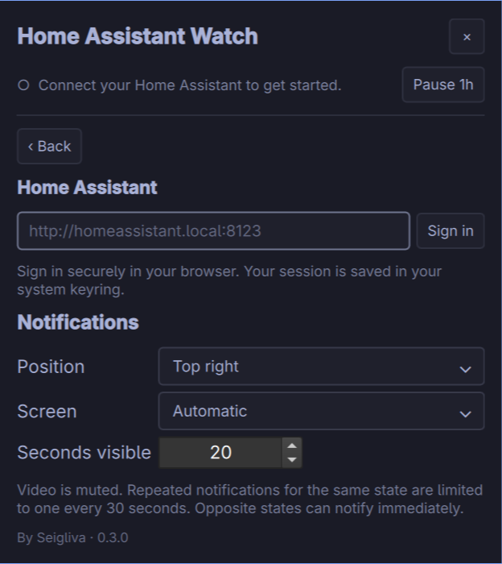
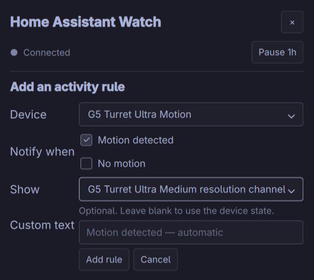
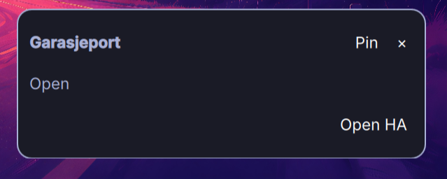
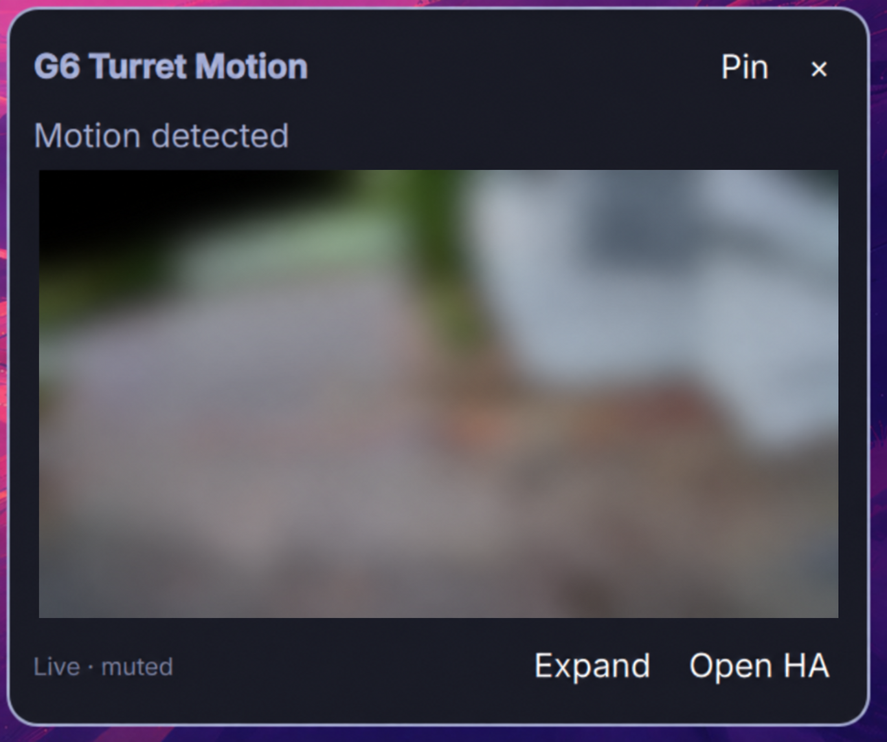

<p align="center"></p>

# Home Assistant Watch for Omarchy

A small camera window when something happens at home. Sign in to Home Assistant,
choose a sensor and a camera, and let Watch handle the desktop preview.

**By Seigliva · Version 0.5.0 · Early release.**

An independent community plugin, not an official Home Assistant product.

Built against Omarchy's Quickshell
plugin API. The transport is tested against a simulated HA server. The maintainer
has also verified the current UI, UniFi camera playback, door contacts, cover
notifications and custom text with a real Home Assistant instance.

## Preview





The setup screenshots were supplied by the maintainer just before the header
tagline was restored in 0.5.0.

Notification examples from the earlier layout:





The screenshots show the working plugin. The camera area in the second image
was blurred with an image editing tool for privacy; it is sharp during normal use.

## What works in this version

- Browser sign-in with Home Assistant's authorization flow. No manually copied token.
- Refresh tokens in the Linux Secret Service keyring through `secret-tool`.
- Automatic discovery of camera, binary sensor, input boolean and cover entities.
- Multiple rules: selected device states → camera preview or text-only popup.
- Choose Open/Closed for contacts, Active/Inactive for other binary sensors,
  and Opening/Open/Closing/Closed for covers. Select one or several states.
- Optional custom text per state; blank fields use an automatic state label.
- HA-provided HLS video, muted, with snapshots while video loads or is unavailable.
- Four corners, selectable monitor, 5–120 seconds on screen.
- Pin, expand, dismiss, and open the camera in Home Assistant.
- One-hour pause and a 30-second cooldown per sensor/camera/state combination. Opposite states can notify immediately.
- Automatic reconnect with backoff after connection loss or resume.
- Uses the active monitor when set to Automatic; does not take keyboard focus.
- Compact native Omarchy bar panel with separate rule editor and settings.
- Theme-aware controls and smaller notification previews. UI text is currently English.
- Sensor lists stay in place during live Home Assistant state updates.

## Requirements

Omarchy with the **Quickshell shell and `omarchy plugin` commands**, Python 3.11+
with venv support, `secret-tool` and an unlocked Secret Service keyring,
`xdg-open`, and the `ffmpeg` and `ffprobe` command-line tools.

On Arch the relevant packages are `python`, `libsecret`, `xdg-utils`,
`ffmpeg`. A Secret Service provider must
already be available (as in a standard configured Omarchy desktop).

Python dependencies live in `${XDG_DATA_HOME:-~/.local/share}/seigliva.ha-watch/venv`,
outside the plugin checkout. System Python is untouched, and Omarchy can
validate and update the plugin without encountering virtual-environment symlinks.

Installation uses pip's mandatory `--require-hashes` mode and accepts wheels
only (`--only-binary=:all:`). Every permitted package file has a SHA-256 recorded
in `requirements.lock`; missing or mismatched hashes stop installation. A Python
version/platform without an approved compatible wheel is rejected instead of
building from source. Existing installed packages are not retroactively audited
by pip; use a fresh runtime when verifying artifact integrity.

## Install

First install the system requirements listed above, then:

```bash
omarchy plugin add https://github.com/Seigliva/omarchy-ha-watch.git --yes
cd ~/.config/omarchy/plugins/seigliva.ha-watch
bash setup.sh
```

Omarchy clones and validates the repository. `setup.sh` installs the version- and SHA-256-locked
Python dependencies into the separate runtime directory and enables the plugin.
No sudo or pkexec is required. The script does not install system packages. It also works from a
separate development checkout, linking that checkout into the plugins directory.

If you enabled the plugin before running setup, the panel explains
that setup is required. Run `bash setup.sh` and restart the shell to retry.

## Connect Home Assistant

Open the house button in the bar, or run:

```bash
omarchy-shell ha-watch settings
```

1. Open **Settings** and enter the base HA address, for example `http://homeassistant.local:8123`.
2. Select **Sign in**. Complete the normal Home Assistant login in your browser.
3. Return to Watch, go **Back** and select **+ Add rule**. Choose **Device**, select **Notify when** states and **Show**, then **Add rule**.
   Optionally enter custom text, such as “Kjellerdør åpnet”, for each selected state.
4. Use **Test** to verify the camera without waiting for motion.
5. Trigger real motion to verify the entire path. The device must transition to one of the selected states.

Use the HA address reachable from this desktop. The browser callback is on
`127.0.0.1` and requires the browser to run on the same computer as the plugin.
No public callback server, HA add-on, MQTT broker, camera password or RTSP URL
is required by this design. The plugin never changes HA automations or devices.

The bar icon opens a compact, theme-aware Omarchy panel. **Edit** opens a
separate rule editor; **Settings** contains login and notification preferences.
Press Escape or click outside to close the panel. Unsaved editor drafts stay
in memory while the shell is running; only **Save changes** applies them.

## Camera compatibility

Watch talks to HA, not to UniFi, Reolink or other manufacturers directly.
This version requests HA's `camera/stream` HLS endpoint. A bounded helper fetches
playlists and segments, then separate FFmpeg processes decode the video. The
Omarchy shell receives only local, fixed-size RGB images: 640 × 360 at up to
10 frames per second, without audio. HLS can take several seconds to start and
lag the live scene. WebRTC-only cameras fall back to snapshots when available.

Snapshot refresh is every five seconds while video is unavailable. Snapshot
and video inputs have byte limits, deadlines and dimension checks; unsupported
or oversized video falls back to the same bounded snapshot path. A pinned
preview stops fetching after ten minutes and must be reopened. Each preview
also has a 256 MiB transfer budget. Pinning protects the active preview from
replacement, and closing it terminates its decoder and removes temporary files.

The supported HLS subset includes unencrypted MPEG-TS and fragmented MP4.
Encrypted or byte-range streams are rejected. Streams above 4096 pixels on
either axis or 8 megapixels are rejected; choose a lower-resolution HA camera
entity if necessary. See [MEDIA_SECURITY.md](MEDIA_SECURITY.md) for all limits
and the separation between the network client, decoder and shell.

Only real state changes from a known state trigger rules. Initial states and
recovery from `unknown` or `unavailable` do not create alerts. Existing rules
without state selections keep their original `on`-only behavior (open-only for
door contacts). New cover rules default to `open`; movement states require
the integration to report `opening`/`closing`. Test previews use the first
selected state and do not control or move the actual device.
Event entities (including some doorbell implementations), arbitrary HA
automation calls and detection labels are not supported yet. A HA helper
`input_boolean` can be used as a trigger in this version.

There is one preview at a time. New activity replaces an unpinned preview;
a pinned preview stays on screen. No event history is stored. Pause state is
session-only, and Watch currently has its own pause control rather than
following Omarchy's Do Not Disturb setting.

## Storage and privacy

Non-secret configuration is inline in the `seigliva.ha-watch` entry in
`~/.config/omarchy/shell.json`. The plugin follows the shell's persistence API.
Refresh tokens are stored only in the keyring, access tokens stay in the
connection process, and camera URLs are passed in memory to the player.
The auth callback uses a random, single-use state value and expires after
five minutes. TLS certificate verification stays enabled.

HA access follows the signed-in user's permissions; selecting cameras in the
UI is not an additional server-side permission boundary. Use HTTPS for a
connection that should be encrypted.

Sign out to revoke the session and remove the keyring entry. If HA is
unreachable during sign-out, revoke the old session in your HA profile later.
Switching to another HA address clears the rules to avoid accidental matches.
Disabling or removing the plugin does not itself revoke an HA session.

## Development and validation

```bash
~/.local/share/seigliva.ha-watch/venv/bin/python -m unittest discover -s tests -v
omarchy-shell ha-watch status
omarchy-shell ha-watch demo
```

Tests start a local mock server and cover OAuth state checks and replay,
expiry, token exchange, sensor transitions, WebSocket discovery, image/stream
requests, cooldown, pause and rejecting external stream URLs. The keyring is
mocked; no user HA instance or credentials are needed. `demo` displays a
text-only popup to test placement without an HA connection.

Implementation:

- `Service.qml`: plugin lifecycle, settings persistence and private JSON IPC.
- `Settings.qml`: native bar panel, rule editor and connection/notification preferences.
- `Preview.qml`: layer-shell camera surface and video player.
- `bridge.py`: browser authorization, keyring and HA WebSocket transport.

Reference APIs: [HA authentication](https://developers.home-assistant.io/docs/auth_api/),
[HA WebSocket](https://developers.home-assistant.io/docs/api/websocket/),
[camera implementation](https://github.com/home-assistant/core/blob/dev/homeassistant/components/camera/__init__.py).

## Disable

```bash
omarchy plugin disable seigliva.ha-watch
```

Sign out first if you also want to revoke the connection.

To remove an installation managed by Omarchy, use `omarchy plugin remove seigliva.ha-watch`.
For a development checkout installed with `setup.sh`, disable the plugin and
remove only the `~/.config/omarchy/plugins/seigliva.ha-watch` symlink, leaving your checkout
intact. Neither operation changes cameras or automations in Home Assistant.

## Update

```bash
omarchy plugin update seigliva.ha-watch --yes
cd ~/.config/omarchy/plugins/seigliva.ha-watch
bash setup.sh
```

For a separate development checkout, use `git pull --ff-only` and `bash setup.sh`.
If the UI still shows an older version, run `omarchy restart shell`, then reopen
Watch. This briefly restarts the bar and shell surfaces, while preserving rules
and the HA session.

`omarchy plugin validate .` works on the installed checkout: the runtime is
stored outside it. Do not create a Python virtual environment inside an
installed plugin folder.

Uninstalling preserves the separate runtime and keyring credentials. Sign out
first to revoke the HA session. You may then delete the dedicated
`~/.local/share/seigliva.ha-watch` directory to remove the runtime as well.
Omarchy may remove the inline rule settings when disabling or removing a plugin;
back up its `shell.json` entry before a reinstall if you want to retain rules.

## Next milestones

Faster video startup, WebRTC, searchable entity pickers,
event-based doorbells, and additional camera/integration compatibility tests.
Marketplace listing requires maintainer approval. Further improvements will
follow user feedback.

## Updating dependency hashes

`requirements.lock` records exact versions and verified hashes for non-yanked
PyPI wheels, including transitive dependencies. `requirements.txt` describes the
direct dependency range and is not used by setup or CI.

To refresh artifacts for the existing pins, run
`python3 scripts/lock-dependencies.py`. The maintainer-only script downloads each
wheel over HTTPS, computes its SHA-256, checks it against PyPI metadata, and
writes the lock only after all downloads verify. It never runs during installation
and does not update versions. Review any changed pins/artifacts, test a fresh
installation, and commit the lock before publishing. Hashes bind the reviewed
files; they are not a security audit of third-party code.
